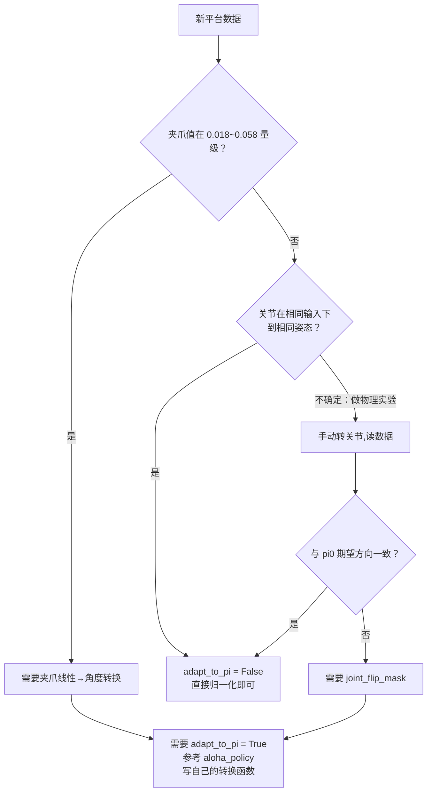

[toc]

# 经过Aloha平台adapt_to_pi参数的理解，我想问一下当我适配想适配新的机器人平台到pi0模型时，我该如何确定模型的动作标准空间和机器人平台的动作标准空间是否一致？去  
  确定这件事的思路是什么？如果不一致，我需要知道哪些信息才能写一个转换的适配模块使得在模型输入输出时进行转换？      

代理的详细分析与我之前的回答完全吻合，现在我补充几个它发现的**额外关键细节**，这些对适配新平台很重要：

---

## 代理分析补充的几个关键细节

### 1. 归一化策略：pi0 vs pi0.5/FAST 不同

这是我之前没强调的一点——**不同模型使用不同的归一化方式**：

| 模型               | 归一化方式 | 公式                                                   |
| ------------------ | ---------- | ------------------------------------------------------ |
| **π₀**             | Z-score    | `(x - mean) / (std + 1e-6)`                            |
| **π₀.₅ / π₀-FAST** | 分位数     | `(x - q01) / (q99 - q01) * 2.0 - 1.0` → 映射到 [-1, 1] |

定义在 `config.py:444`：
```python
use_quantile_norm = model_config.model_type != ModelType.PI0
```

这意味着**同一个平台如果适配不同的模型（π₀ vs π₀.₅），归一化统计量需要重新计算**。你适配新平台时，必须知道自己目标模型用的是哪种归一化。

### 2. FAST 模型的摄像头掩码规则不同

π₀-FAST 和 π₀/π₀.₅ 对占位图像的掩码处理**完全相反**：

```python
# DROID Inputs (droid_policy.py:133-144)
match self.model_type:
    case PI0 | PI05:
        # 占位图像 → mask=False (告诉模型忽略)
        right_wrist = np.zeros_like(base_image), np.False_
    case PI0_FAST:
        # 占位图像 → mask=True (防止自回归信息泄漏)
        base_1_rgb = np.zeros_like(base_image), np.True_
```

Fast 模型是自回归架构，如果占位图像 mask=False，模型可能会利用"这个图像不存在"的信息来作弊。**如果你适配 FAST 模型，务必注意这一点**。

### 3. DROID 的条件增量逻辑

DROID 的 delta 变换是**有条件**的，这提供一个很好的设计模式：

```python
# config.py:822-829
if self.action_space == DroidActionSpace.JOINT_POSITION:
    # 关节位置是绝对值 → 转增量
    data_transforms = data_transforms.push(
        inputs=[DeltaActions(mask=make_bool_mask(7, -1))],
        outputs=[AbsoluteActions(mask=make_bool_mask(7, -1))],
    )
# else: JOINT_VELOCITY → 已经是增量，不处理
```

你的 DataConfigFactory 也可以提供这样的 "if" 逻辑——让用户在配置时指定动作类型，然后条件性地插入 delta 变换。

### 4. 三个平台完整变换矩阵

代理分析给出了每个平台变换的全貌。我把最重要的对比放在一张表里：

| 环节           | ALOHA                            | DROID                                       | LIBERO                 |
| -------------- | -------------------------------- | ------------------------------------------- | ---------------------- |
| **原生维数**   | 14                               | 8                                           | 7                      |
| **最终填充到** | 32                               | 32                                          | 32                     |
| **坐标系转换** | 关节翻转 + 夹爪线性→角度         | 无                                          | 无                     |
| **图像数**     | 4个→映射3个(含1个填充)           | 2个→映射3个(含1个填充)                      | 2个→映射3个(含1个填充) |
| **增量动作**   | 7个关节+7个关节=True，夹爪=False | 7个关节=True，夹爪=False (仅JOINT_POSITION) | 数据已是增量           |
| **输出裁剪**   | [:14]                            | [:8]                                        | [:7]                   |
| **归一化**     | Z-score (π₀)                     | Z-score/分位数                              | 分位数 (π₀.₅)          |

---

这些细节补充到之前给你的决策框架里，你现在应该可以非常清晰地判断：**你的新平台的每个维度，在上述哪个环节需要转换，以及如何转换。**

# 另外，为何libero_policy.py中就没有adapt_to_pi这种类似的参数，是因为，libero的动作标准空间本身就和pi0模型所用的动作空间一致吗？

好问题。答案比你想象的更直接，也揭示了一个重要设计理念。

## 直接回答：是的，LIBERO 不需要 `adapt_to_pi` 就是因为一致

看代码就清楚了。LIBERO 的 `LiberoInputs` 和 `LiberoOutputs` 极其简单：

```python
# libero_policy.py — 几乎没有数值转换
class LiberoInputs:
    def __call__(self, data):
        base_image = _parse_image(data["observation/image"])
        wrist_image = _parse_image(data["observation/wrist_image"])
        return {
            "state": data["observation/state"],       # ← 直接传，不变
            "image": {"base_0_rgb": ..., "left_wrist_0_rgb": ...},  # 只改命名
            ...
        }
```

对比 ALOHA：
```python
# aloha_policy.py — 大量数值转换
class AlohaInputs:
    def __call__(self, data):
        data = _decode_aloha(data, adapt_to_pi=True)  # ← 解码+转换
        # _decode_aloha 内部调用：
        #   _decode_state() → _joint_flip_mask() * state + _gripper_to_angular()
```

LIBERO 从输入到输出，**没有任何关节翻转、量纲转换、坐标系对齐**——它天然就和 π₀ 的内部格式一致。

---

## 但为什么 LIBERO 一致而 ALOHA 不一致？

这个问题触及 π₀ 设计的核心决策。

### π₀ 的"内部格式"不是凭空定义的

π₀ 基础模型在预训练时收集了大量来自不同机器人的数据。**"内部格式"就是这些预训练数据中大多数平台使用的格式**。它是一个**经验性的、通过统计多数确定的格式**，而不是一个先验的理论标准。

所以回答是：

> **LIBERO 之所以"一致"，很可能是因为 LIBERO 格式的数据本来就是 π₀ 预训练语料的一部分，或者 LIBERO 使用的坐标约定恰好与 π₀ 预训练语料中多数平台相同。**

而 ALOHA 不同，是因为 ALOHA 的硬件有独特的物理约定：

| 差异点       | ALOHA 的独特之处                      | 为什么独特                                                                         |
| ------------ | ------------------------------------- | ---------------------------------------------------------------------------------- |
| **关节方向** | 第2、3关节方向与 π₀ 相反              | ALOHA 使用 Interbotix Dynamixel 舵机，其零位和旋转正方向定义与其他常见机器人臂不同 |
| **夹爪量纲** | 线性位移（米） → 需运动学公式转为角度 | ALOHA 底层用线性电位计测量夹爪开合宽度，而 π₀ 预训练数据中夹爪编码为电机轴角       |

**这两种差异都不是"对错"问题，而是物理实现不同。** `adapt_to_pi` 本质上是**一次性的硬件标定参数**。

### 更深层：`adapt_to_pi` 是一个"历史偶然性"参数

注意 `adapt_to_pi` 的参数说明（`aloha_policy.py:224-228`）：

```python
# 是否适配到 π₀ 内部格式。
# True  → 将 ALOHA 的关节和夹爪值转换到 π₀ 内部空间
#          （这个内部空间是 π₀ 基础模型预训练时使用的）
# False → 保持原始值不变（仅当使用未经过预训练的模型时需要）
```

也就是说 `adapt_to_pi=False` 意味着**完全不转换，直接用 ALOHA 原始值训练模型**。这如果开了，模型学到的就是 ALOHA 原生空间，不能直接用预训练权重推理，必须微调。

**反过来，如果 LIBERO 当时也需要 `adapt_to_pi`，它会被加在 `LiberoInputs` 里，只是 π₀ 团队在做标定时发现 LIBERO 不需要。**

---

## 一个更强的证据：extra_delta_transform

别忘了 LIBERO 配置里还有这个参数：

```python
# config.py:699-701
class LeRobotLiberoDataConfig(DataConfigFactory):
    extra_delta_transform: bool = False  # 数据已经是 delta
    #                                     # 旧版 π₀ 检查点才需要额外再做一次 delta
```

LIBERO 配置中有 `extra_delta_transform`（旧版兼容），但没有 `adapt_to_pi`（坐标系兼容）——这恰好印证了：

> **LIBERO 和 π₀ 的差异是"增量/绝对"这个表示层的差异（由 delta transform 解决），而不是"坐标系/量纲"的物理差异（不需要 adapt_to_pi）。**

---

## 给你的启示

当你要适配一个新平台时，你需要回答的是 **"我的平台和 π₀ 内部格式之间，存在什么类型的差异？"**

| 差异类型         | 表现                   | 解决方案                         | 示例                                              |
| ---------------- | ---------------------- | -------------------------------- | ------------------------------------------------- |
| **无差异**       | 数值直接可用           | 无需特殊处理                     | LIBERO 的状态和动作                               |
| **表示层差异**   | 绝对 vs 增量           | `DeltaActions`/`AbsoluteActions` | LIBERO extra_delta, ALOHA use_delta_joint_actions |
| **量纲差异**     | 单位不同（米 vs 弧度） | 自定义转换函数                   | ALOHA 夹爪 `_gripper_to_angular`                  |
| **符号差异**     | 正方向相反             | 翻转掩码                         | ALOHA `_joint_flip_mask`                          |
| **物理空间差异** | 关节空间 vs 任务空间   | 运动学正/逆解                    | DROID 的 `action_space` 选择                      |

**判断方法：** 把你的平台和某个已知兼容 π₀ 的平台（如 LIBERO）放在同一姿态下，对比它们的关节值向量。如果数值符号或比例有明显偏差，你就需要 `adapt_to_pi` 式的标定。如果没有，直接复用 LIBERO 的模式即可。

# 另外一个问题，我想确定VLA模型本身的动作空间。这个东西是不是根本不取决于模型本身的结构而是取决于你所使用的基座模型权重是在什么动作空间中训练出来的？  

这是一个洞察力极强的问题，触及了整个框架设计的核心哲学。让我给你最直接的回答，然后用例子证明。

## 一句话回答

> **完全正确。VLA 模型的"动作空间"不取决于模型结构，只取决于预训练权重及其变换管道。**

无论是 π₀、π₀.₅ 还是 π₀-FAST，它们的模型结构都只是：

```python
f(observation) → [action_dim] 维向量  # 只是一组浮点数
```

模型结构本身**没有任何语义信息**。它不知道第 0 维度是关节 1 还是关节 2，是弧度还是角度，是绝对位置还是增量。所有语义都来自训练时数据经过的变换管道。

## 最直接的证据：同一模型架构可以学完全不同的动作空间

看 `config.py` 中的几个配置。

**证据1：ALOHA 的 `adapt_to_pi` 开关**

```python
# 同一个模型架构 (Pi0Config)，同一个 ALOHA 数据集
# 唯一的区别：adapt_to_pi 的值

# 方案A: 用 π₀ 内部格式 (adapt_to_pi=True)
TrainConfig(
    name="pi0_aloha",
    model=pi0_config.Pi0Config(action_dim=32),  # ← 相同的模型
    data=LeRobotAlohaDataConfig(adapt_to_pi=True),  # ← 转换到 π₀ 空间
)
# → 模型输出在 π₀ 内部空间中

# 方案B: 用原始 ALOHA 格式 (adapt_to_pi=False)
TrainConfig(
    name="pi0_aloha_raw",
    model=pi0_config.Pi0Config(action_dim=32),  # ← 完全相同的模型
    data=LeRobotAlohaDataConfig(adapt_to_pi=False),  # ← 不转换
)
# → 模型输出在 ALOHA 原生空间中
```

**同样一个模型架构**，仅仅因为变换管道的不同，**学出来的是两个不同的动作空间**。

**证据2：DROID 的动作空间选择**

```python
# RLDSDroidDataConfig 中条件性地添加 delta transform
if self.action_space == DroidActionSpace.JOINT_POSITION:
    # 动作是绝对关节位置 → 转换成 delta 喂模型
    data_transforms.push(inputs=[DeltaActions(...)], outputs=[AbsoluteActions(...)])
# else: JOINT_VELOCITY → 已经是 delta，不处理
```

同一个 DROID 数据集，因为 `action_space` 枚举值的不同，模型学到的动作空间就不同（一个是绝对位置，一个是速度）。

**证据3：仿真 vs 实物的 ALOHA**

```python
# 实物 ALOHA：use_delta_joint_actions=True
TrainConfig(name="pi0_aloha", data=LeRobotAlohaDataConfig(use_delta_joint_actions=True))

# 仿真 ALOHA：use_delta_joint_actions=False  
TrainConfig(name="pi0_aloha_sim", data=LeRobotAlohaDataConfig(use_delta_joint_actions=False))
```

同样是 ALOHA，同样是 Pi0Config，实物模型学的是增量动作，仿真模型学的是绝对动作。**模型结构完全一样，学到的空间完全不同。**

## 那 `action_dim = 32` 难道不是架构决定的吗？

是，也不是。我们来拆开看：

```python
# 模型架构确实限制了 action_dim
class BaseModelConfig:
    action_dim: int = 32      # 输出向量长度
    action_horizon: int = 50  # 预测多少步
```

但注意代码中同时存在的 `PadStatesAndActions`：

```python
# transforms.py
class PadStatesAndActions:
    def __call__(self, data):
        data["state"] = pad_to_dim(data["state"], self.model_action_dim, axis=-1)   # 不足就补零
        data["actions"] = pad_to_dim(data["actions"], self.model_action_dim, axis=-1)
        return data
```

**真实流程：**
```
ALOHA 14维 → DeltaActions → Normalize → PadStatesAndActions(32) → 模型
                                                                       │
                                                                       ▼
                                                          模型输出 32 维向量
                                                                       │
                                                                       ▼
ALOHA 14维 ← Unnormalize ← AbsoluteActions ← 只取前14维 ←
```

所以架构的 `action_dim=32` 是**工程上的上限分配**（padding target），不是模型"使用了 32 个自由度"。模型只看 32 维浮点数，有效信息只在前 14 维（或 8 维、7 维），后面的都是无害的零。

## 那"模型动作空间"到底指什么？

当你问"一个 π₀ 预训练权重它的动作空间是什么"时，真正的答案是：

> **"它的预训练数据处理管道的逆变换是什么。"**

因为：
```
原始数据 → [变换管道 T] → 模型看到的训练目标
模型输出 = 训练目标的预测值
模型输出 → [T的逆变换] → 可执行动作
```

**所谓"模型 X 的动作空间"就是变换管道 T 定义的数学空间。** 模型本身只是一个从观察到 32 维浮点数的映射函数，对物理意义一无所知。

## 这一点为什么重要？

因为它意味着：

1. **你可以用同一个预训练权重做不同的事情** ── 通过修改变换管道，把不同机器人的数据映射到同一个"归一化空间"喂给同样的权重

2. **微调本质上是在扩展/修正这个变换管道的逆映射** ── 当 `adapt_to_pi=True` 时，你是在复用预训练权重的"内部空间"知识；当 `adapt_to_pi=False` 时，你是在训练模型学习全新的动作空间语义

3. **判断"两个平台动作空间是否一致"最终变成**：**它们的变换管道末端是否将数据映射到同一个数学分布中**。这就是为什么同一个权重可以同时用于 ALOHA 和 DROID——只要各自的 `Inputs`/`Outputs` 把数据映射到模型在预训练时看到过的分布范围。

# 那么我如何知道官方推出的pi0.5_base模型权重是在什么空间中训练出来的呢，如何查阅？另外如果动作空间这么重要，如何体现模型的泛化性，换个机器人本体就不好用了啊

好问题。让我直接回答这两个问题。

---

## 一、如何知道 pi0.5_base 是在什么空间中训练的？

**明确回答：你无法确定唯一的"空间"，因为基础模型是在多平台数据上混合训练的。**

看代码中的证据：

### 证据：所有微调配置都指向同一个 base checkpoint

```python
# pi0_libero 微调：使用 pi0_base 权重，但用 libero 的资产
TrainConfig(name="pi0_libero",
    weight_loader=CheckpointWeightLoader("gs://openpi-assets/checkpoints/pi0_base/params"),
    # 注意 assets 来自 pi0_base/assets
)

# pi0_aloha_pen_uncap 微调：也使用 pi0_base 权重，但用 trossen 的资产
TrainConfig(name="pi0_aloha_pen_uncap",
    weight_loader=CheckpointWeightLoader("gs://openpi-assets/checkpoints/pi0_base/params"),
    assets=AssetsConfig(assets_dir="gs://openpi-assets/checkpoints/pi0_base/assets", asset_id="trossen"),
)
```

**同一个 `pi0_base` 权重**，被用于 ALOHA、DROID、LIBERO 三个完全不同的平台的微调起点。这意味着：

> pi0_base 预训练时用的不是单一动作空间，而是一个**混合了多平台数据的公共空间**。

### 查阅方法（你实际上能查到的信息）

你需要关注三个层次，而**不是"模型结构"层**：

| 层               | 你能查什么                  | 在哪里查                                                                                         |
| ---------------- | --------------------------- | ------------------------------------------------------------------------------------------------ |
| **数据源**       | 预训练用了哪些数据集        | 论文 / README / 官方博客。代码中不可见（base model 是闭源预训练的）                              |
| **变换管道**     | 每个平台用了什么 transforms | `aloha_policy.py` / `droid_policy.py` / `libero_policy.py` 中的 Inputs/Outputs                   |
| **归一化统计量** | 每个维度的均值和标准差      | `gs://openpi-assets/checkpoints/pi0_base/assets/{trossen,droid,libero}/` 中的 mean.npy / std.npy |

**实操方法：检查 norm stats 中的 asset_id**

```python
# config.py:443
asset_id = self.assets.asset_id or repo_id
```

推理时，你看到的 `asset_id` 决定了用什么 norm stats：
- `trossen` → ALOHA 格式（14 维关节空间）
- `droid` → DROID 格式（8 维关节+夹爪）
- `libero` → LIBERO 格式（7/8 维）

这些 asset_id 对应的 norm stats 文件就定义了模型在"归一化后"看到的分布。**但预训练时模型见过所有这些分布**。

### 获取更多信息的途径

真实情况是，**base model 的具体训练数据细节并未完全在代码中公开**。你最好的查找方向是：

1. **Physical Intelligence 的官方论文/blog**：搜索 "pi0" / "pi0.5" 论文，查看 Training Data 章节
2. **norm stats 目录本身**：`gs://openpi-assets/checkpoints/pi0_base/assets/` 下列出了所有预训练时使用的平台，**每个平台一个子目录**
3. **推理配置的 `asset_id`**：你实际用的是哪个 asset_id，就代表你走的是哪套归一化

**结论：你不需要知道 pi0.5_base 的"绝对动作空间"——你需要知道的是它兼容哪些平台，以及你的平台的数据通过 `Inputs` 变换后是否落在这个兼容范围内。**

---

## 二、如果动作空间这么重要，泛化性从何而来？

这是最核心也是最反直觉的地方。让我用一个具体的类比解释。

### 关键洞察：模型泛化的是"任务概念"，而非"具体数值"

想象一个人类例子：

> 你学会了用右手拿杯子。你从来没试过左手拿杯子。
> 但当你第一次用左手时，你仍然能拿起杯子——即使关节角度完全不同、肌肉发力方向相反。

**你学会的不是"某个具体关节角度序列"，而是"抓取"这个概念。**

VLA 模型也是类似的道理。**模型在归一化空间中学习的不是"轴1=0.5弧度"，而是"从物体位置到抓取成功"的映射关系。**

### pi0_base 是如何实现跨平台泛化的？

来看实际机制。假设 pi0_base 在预训练时见过 ALOHA 和 DROID 的数据：

```
ALOHA 原始数据 (14维):
  joint_1=0.5, joint_2=-1.2, ...gripper=0.02...
    │
    ▼ AlohaInputs(adapt_to_pi=True)  → 关节翻转、夹爪转换
    ▼ DeltaActions                    → actions - state
    ▼ Normalize(trossen_stats)        → (x - mean) / std
    ▼ PadStatesAndActions(32)         → 补零到 32 维
    ▼
  [模型看到的是 32 维的归一化张量]

DROID 原始数据 (8维):
  joint_1=0.3, joint_2=-0.8, ...gripper=0.5...
    │
    ▼ DroidInputs                     → 拼接 7+1
    ▼ DeltaActions(如果 JOINT_POSITION) → actions - state  
    ▼ Normalize(droid_stats)          → (x - mean) / std
    ▼ PadStatesAndActions(32)         → 补零到 32 维
    ▼
  [模型看到的也是 32 维的归一化张量]
```

**两者的归一化统计量不同，但归一化后的分布是类似的**（均值接近 0，标准差接近 1）。模型学到的就是在这个公共归一化空间中的模式。

### 泛化的三个层次

```
层次1：相同的物理意义在不同的数值空间中
    "关节角度" → 在 ALOHA 中可能是 14 维中的第 2 维
                在 DROID 中可能是 8 维中的第 1 维
                但归一化后都在 [0, 1] 左右
    → 模型学会的是一般性的"关节相关规律"

层次2：相同的语义在不同的输入组合中
    "抓取物体" → ALOHA 是双夹爪闭合
                DROID 是单夹爪闭合
                图像中看到的都是夹爪靠近物体
    → 模型学会的是"视觉特征 → 夹爪闭合动作"的映射

层次3：相同的任务视觉特征
    "看到红色方块" → 无论在 ALOHA 还是 DROID 的摄像头中，看起来差不多
    → 视觉编码器 SigLIP 提供了与机器人本体无关的视觉特征
```

### 所以泛化来自三个独立机制的叠加

| 机制                  | 起什么作用                           | 代码里在哪                |
| --------------------- | ------------------------------------ | ------------------------- |
| **1. 归一化**         | 把不同平台的数值拉到同一分布         | `Normalize(norm_stats)`   |
| **2. 填充到公共维度** | 所有平台都在 32 维空间中操作         | `PadStatesAndActions(32)` |
| **3. 视觉+语言编码**  | 任务语义由视觉和文本决定，与本体无关 | SigLIP + Gemma            |

**权重加载器 + 变换管道的组合**使得同一组权重可以在不同平台上复用。核心是：

```
┌─────────────────────────────────────────────────────┐
│                    模型内部                           │
│  ┌──────────────────────────────────────────────┐   │
│  │ 归一化空间（32维，均值为0，标准差≈1）          │   │
│  │ 模型学会的是"在这个空间中，给定观察→动作"的    │   │
│  │ 一般性映射                                    │   │
│  └──────────────────────────────────────────────┘   │
│              ▲                │                      │
│     Normalize│                │Unnormalize           │
│              │                ▼                      │
│  ┌──────────────────────────────────────────────┐   │
│  │ 平台特定变换（Inputs/Outputs, DeltaActions）   │   │
│  │ 把各个平台的"物理空间"映射到"归一化空间"       │   │
│  └──────────────────────────────────────────────┘   │
│              ▲                │                      │
│     Aloha/   │                │                      │
│     Droid/   │                │                      │
│     Libero   │                ▼                      │
│  ┌──────────────────────────────────────────────┐   │
│  │ 各平台的原始物理动作空间                        │   │
│  │ ALOHA: 14维, DROID: 8维, LIBERO: 7维         │   │
│  └──────────────────────────────────────────────┘   │
└─────────────────────────────────────────────────────┘
```

### 那为什么换机器人有时不好用？

换机器人不好用，不是因为"动作空间不同"，而是因为**某个关键维度在预训练数据中没见过类似分布**。具体原因可能是：

1. **摄像头位置/类型不同** → 模型看不懂新视角下的场景
2. **新的自由度** → 比如 ALOHA 是双臂（14维），而新机器人是单臂 + 可移动底座（10维），虽然都填充到 32 维，但底座的运动模式模型从未见过
3. **动力学特性差异** → 模型预测的 delta 动作在新机器人上可能因为物理参数不同而无法稳定执行

**这就是为什么 `adapt_to_pi` 和 `compute_norm_stats` 是必要的**——前者处理坐标系/量纲，后者收集新数据分布的特征。当改变足够大时，微调就是让模型学会新分布的最直接方式。

---

## 一句话总结

> 你"查阅" base 模型动作空间的方式是：**看在推理/微调时，你的平台 Inputs 变换 + Normalize 产出的分布是否在预训练模型见过的范围内**——而这是通过 asset_id 对应的 norm stats 和 `adapt_to_pi`/`DeltaActions` 等变换来保证的。泛化性则来自：归一化抹平数值差异、填充统一维度、视觉语言提供本体无关的语义信号。


# 到底如何判断一个新增的机器人平台需不需要增加adapt_to_pi的功能，比如aloha平台的夹爪数据都是需要夹爪线性位移值转换为π₀的夹爪角度，还要反转关节方向，而我更换为tron2机器人，官方教程就屏蔽了这些，好像tron2平台采集的数据集天生就适配pi模型（只需要归一化处理即可）。而且就算知道一个平台要适配pi，也得知道如何适配才行，知道如何换算。想熟悉这些东西需要知道哪些机器人的知识？

好问题，这是整个 openpi 适配工作中最需要**机器人领域知识**的部分。让我从下到上讲清楚。

---

## 一、`adapt_to_pi` 到底解决什么问题？

对比两个平台的数据流就清楚了：

```
ALOHA 实物数据流:
  原始传感器数据（关节角单位: rad，夹爪单位: mm，线性位移）
      │
      ▼ adapt_to_pi=True（需转换）
      │   ┌ 关节方向取反（×-1）：ALOHA 和 pi0 对某些关节的正方向定义相反
      │   └ 夹爪线性位移 → 角度弧度：ALOHA 用电位计量夹爪开合（mm），pi0用编码器（rad）
      ▼
  pi0 内部标准格式 ← 这是 pi0_base 预训练时模型"见过"的数据空间

Tron2 数据流:
  原始传感器数据
      │
      ▼ adapt_to_pi=False（不需转换）
      │   从 Tron2 里读出来的数据无需转换就直接送到pi0的内部标准格式
      ▼
  pi0 内部标准格式 ← 直接兼容！
```

**所以 `adapt_to_pi` 的实质是：你的机器人的"本机坐标系"和 pi0_base 预训练数据的"标准坐标系"是否有差异。**

---

## 二、为什么 Tron2 不需要？

关键在**对比三个平台**：

| 平台           | state/action 维度 | 关节方向与 pi0 的关系               | 夹爪格式                                 | 结论       |
| -------------- | ----------------- | ----------------------------------- | ---------------------------------------- | ---------- |
| **ALOHA 实物** | 14 (6+1+6+1)      | ❌ **部分相反**：第2、3关节方向相反 | ❌ **线性位移**（mm），pi0 用角度（rad） | **需转换** |
| **DROID**      | 8 (7+1)           | ✅ 方向一致                         | ✅ 统一归一化处理                        | **不需要** |
| **Tron2**      | 16 (7+1+7+1)      | ✅ 方向一致                         | ✅ 格式与 pi0 兼容                       | **不需要** |

具体原因：

1. **Tron2 的关节方向和 pi0 一致**。ALOHA 需要用 `_joint_flip_mask` 对第2、3关节乘以 -1，而 Tron2 **不需要这个操作**——说明 Tron2 和 pi0 对关节正负方向的定义是相同的。

2. **Tron2 的夹爪格式和 pi0 兼容**。ALOHA 需要一个复杂的 `_gripper_to_angular` 函数把线性位移（米）转换为弧度角——而 Tron2 直接就是角度值，不需要这个转换。

3. **Tron2 的数据收集流程可能天然对齐了 pi0 的格式**。这取决于 Tron2 的底层控制器和 SDK——如果它底层用 Interbotix/或与 pi0 训练数据相同的机器人平台，关节空间自然就是兼容的。

> 注意看 `tron2_policy.py` 中的注释（第 68-70 行）：
> ```python
> # Tron2 的关节空间是未知的，所以设为 False 表示不做适配。
> # 如果设置为 True，会将 ALOHA 标准关节角度转换为 π 内部运行时的关节空间。
> ```
> 这里明确写了：`adapt_to_pi` 的逻辑就是**ALOHA 专用的**（包括 joint_flip_mask 和 gripper conversion），其他平台复用这套代码反而会出错。

---

## 三、如何判断一个新平台是否需要 adapt_to_pi？

你需要回答这三个问题，逐一排查：

### 1️⃣ 关节的"零位"和"正方向"是否一致？

```
pi0_base 预训练数据:
  关节 i = +0.5 rad  → 机械臂的某个姿态
你的机器人:
  关节 i = +0.5 rad  → 是否到同一个姿态？
```

这是最难的部分。**关节方向的符号差异没有通用规则**，取决于：
- 机器人的 DH 参数（Denavit-Hartenberg 约定）
- 电机的安装位置和方向
- 编码器的读数方向

**如何判断？**
- 查阅机器人的 URDF/SDF 文件，看关节坐标轴定义
- 物理实验：手动转动关节到正方向，看传感器读数的变化方向
- 对比 pi0 官方支持平台的关节翻转掩码（ALOHA 是 14 维，UR5 是 6 维，等等）

### 2️⃣ 夹爪是线性值还是角度值？

```
ALOHA: 电位计测量 → 线性位移值（单位：米/毫米）
       pi0 训练数据中夹爪用的是 编码器→角度值（单位：弧度）

差异意味着：
  夹爪全开: ALOHA=0.05800m,  pi0 空间=1.6296 rad（归一化到 1）
  夹爪全闭: ALOHA=0.01844m,  pi0 空间=0.5476 rad（归一化到 0）
```

**如何判断？**
- 查你机器人的夹爪传感器手册：电位计（线性）还是编码器（角度）
- 看数据：夹爪值在 `[0.018, 0.058]` 量级 → 线性位移；在 `[-1.5, 1.5]` 量级 → 角度

### 3️⃣ 归一化统计量是否能覆盖你的数据范围？

如果上面两个都一致，但你机器人的**关节极限角度**和 pi0_base 预训练数据不同，需要通过归一化处理。这就是 `compute_norm_stats.py` 的职责——它会扫描你的整个数据集，计算出每个维度的均值和标准差，然后通过 `Normalize`/`Unnormalize` 把数据对齐到标准范围。

**`adapt_to_pi` 解决的是"空间（坐标系/量纲）差异"，归一化解决的是"数值范围差异"**，两者是正交的。

---

## 四、如果真的需要适配，需要哪些机器人知识？

这是按学习成本排序的：

### 第1层：刚体运动学基础（必须）
- **关节空间 vs 任务空间**：理解机器人是用关节角控制还是末端位姿控制
- **旋转方向约定**：右手法则、关节正方向的定义
- **自由度**：一个机器人有几个关节，每个做什么运动（旋转/平移）

### 第2层：本机硬件知识（必须）
- **取传感器值**：读编码器读数、夹爪电位计值
- **看 URDF/SDF**：理解关节坐标系相对于基坐标系的变换
- **看控制代码**：开发板/控制柜输出的状态向量是什么格式（比如 `[j1,j2,...,j6, gripper]` 还是其他顺序）
- **做物理实验**：手动转关节 → 看数据变化 → 推断正方向

### 第3层：对比分析（核心困难）
- **你在 pi0 的"标准空间"中找一个已知参考点**
  - ALOHA 是 pi 团队第一个适配的平台，它的转换关系（`_joint_flip_mask`）就是 pi0 标准空间的"定义"——是物理标定出来的，不是推导出来的
  - 但这不代表所有机器人都要"对齐到 ALOHA 的空间"

- **如何找这个转换关系？** 最实用的方法：

  ```
  Step 1: 把你的数据直接喂给 pi0 模型（adapt_to_pi=False）
  Step 2: 看效果好不好
    - 好 → 不需要适配
    - 不好 → 需要分析差异
    
  Step 3: 如果不好，做"平行对比实验"
    - 物理姿势：把机械臂摆到某个已知姿态（比如竖直向上）
    - 读数据：记下你的传感器值
    - 找参考：找 pi0 在同一姿态下的期望值（通过已知可运行的平台数据推断）
    - 算差异：差值就是需要转换的量
  ```

### 第4层：数学功底（可遇不可求）
- **前向/逆向运动学**：如果你需要将编码器计数转换为角度，或将线性位移转换为角度
- **刚体变换**：如果 pi0 用任务空间（末端位姿）而你的机器人用关节空间

---

## 五、最实用的"菜鸟指南"：三步判断法

如果你面对一个新机器人，完全不知道要不要开 `adapt_to_pi`：



但更现实的方法是：**先设 False，训练 5k 步看效果**。如果 loss 降不下去或推理效果差，再研究是否需要适配。这是因为：

- pi0_base 在 32 维 action space 上预训练，你只用了其中 16 维（Tron2）。剩余维度通过 `PadStatesAndActions` 填充为 0，模型学到的本质是**预测你喂给它的那 16 维数据分布**。
- 微调 20k 步足够让模型参数大幅调整——**就算关节方向完全相反，模型也能扭转参数来适应**（但需要更多数据/更多步数）
- 真正需要 `adapt_to_pi` 的场景只有一个：**关节方向相反 + 数据集太小**，模型没有足够的统计量来自己纠正。

---

## 总结

| 问题                         | 答案                                                                                                      |
| ---------------------------- | --------------------------------------------------------------------------------------------------------- |
| **Tron2 为什么不需要？**     | 它的关节方向和 pi0 一致，夹爪已经是角度格式，数据天然兼容                                                 |
| **怎么知道一个新平台需要？** | 查关节方向、夹爪格式、做物理对照实验                                                                      |
| **需要什么知识？**           | 刚体运动学基础 + 读 URDF + 物理实验 + 对比分析能力                                                        |
| **最难的在哪？**             | **pi0 标准空间没有文档**——它是通过 `_joint_flip_mask` 等硬编码间接定义的，需要对照 ALOHA 的物理意义去反推 |

实际上，**大多数平台不需要 `adapt_to_pi`**。DROID 不需要，Tron2 不需要，LIBERO 不需要。ALOHA 是唯一需要的——因为 ALOHA 的夹爪传感器是电位计（输出线性位移），和 pi0 标准数据中的编码器（输出角度）**量纲不同**，必须转换。